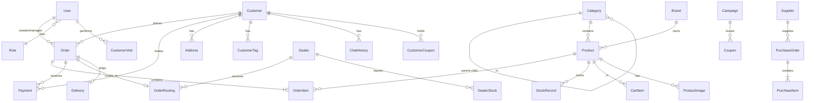

# 华启商城 — 数据库设计

## 1. ER 关系图



## 2. 核心数据模型

### 2.1 用户与权限

**User（系统用户）**
| 字段 | 类型 | 说明 |
|------|------|------|
| id | String (UUID) | 主键 |
| name | String | 姓名 |
| phone | String (unique) | 手机号 |
| password | String | 密码(bcrypt) |
| role | Enum | ADMIN/SALESPERSON/WAREHOUSE/FINANCE |
| avatar | String? | 头像 |
| isActive | Boolean | 是否启用 |
| createdAt | DateTime | 创建时间 |

### 2.2 客户

**Customer（客户/消费者）**
| 字段 | 类型 | 说明 |
|------|------|------|
| id | String (UUID) | 主键 |
| name | String | 姓名/店名 |
| phone | String (unique) | 手机号 |
| password | String | 密码 |
| type | Enum | CONSUMER/DEALER |
| avatar | String? | 头像 |
| creditLimit | Decimal | 信用额度(B端) |
| balance | Decimal | 账户余额 |
| points | Int | 积分 |
| salesPersonId | String? | 所属销售员 |
| isVerified | Boolean | 是否已认证 |

**Dealer（经销商扩展信息）**
| 字段 | 类型 | 说明 |
|------|------|------|
| id | String (UUID) | 主键 |
| customerId | String | 关联客户ID |
| shopName | String | 门店名称 |
| businessLicense | String? | 营业执照号 |
| latitude | Decimal | 纬度 |
| longitude | Decimal | 经度 |
| serviceRadius | Int | 服务半径(米) |
| zone | String | 所在区域 |
| isAccepting | Boolean | 是否接单中 |

**Address（收货地址）**
| 字段 | 类型 | 说明 |
|------|------|------|
| id | String (UUID) | 主键 |
| customerId | String | 客户ID |
| name | String | 收货人 |
| phone | String | 联系电话 |
| province | String | 省 |
| city | String | 市(湘潭市) |
| district | String | 区 |
| detail | String | 详细地址 |
| latitude | Decimal? | 纬度 |
| longitude | Decimal? | 经度 |
| isDefault | Boolean | 默认地址 |

### 2.3 产品与分类

**Category（分类）**
| 字段 | 类型 | 说明 |
|------|------|------|
| id | String (UUID) | 主键 |
| name | String | 分类名 |
| parentId | String? | 父分类ID |
| icon | String? | 图标 |
| sortOrder | Int | 排序 |
| isActive | Boolean | 是否启用 |

**Brand（品牌）**
| 字段 | 类型 | 说明 |
|------|------|------|
| id | String (UUID) | 主键 |
| name | String | 品牌名 |
| logo | String? | Logo图片 |
| description | String? | 品牌描述 |

**Product（产品）**
| 字段 | 类型 | 说明 |
|------|------|------|
| id | String (UUID) | 主键 |
| sku | String (unique) | SKU编码 |
| barcode | String? | 条形码 |
| name | String | 产品名称 |
| categoryId | String | 分类ID |
| brandId | String | 品牌ID |
| unit | String | 单位(瓶/箱/件) |
| spec | String? | 规格(500ml/750ml) |
| costPrice | Decimal | 进价 |
| wholesalePrice | Decimal | 批发价 |
| retailPrice | Decimal | 零售价 |
| memberPrice | Decimal? | 会员价 |
| stock | Int | 当前库存 |
| safeStock | Int | 安全库存 |
| bulkThreshold | Int | 大单阈值(超过此数量为大单) |
| description | String? | 产品描述 |
| status | Enum | ACTIVE/INACTIVE/OUT_OF_STOCK |
| salesCount | Int | 销量统计 |

### 2.4 订单与分单

**Order（订单）**
| 字段 | 类型 | 说明 |
|------|------|------|
| id | String (UUID) | 主键 |
| orderNo | String (unique) | 订单编号 |
| customerId | String | 客户ID |
| type | Enum | RETAIL/WHOLESALE/GROUP_BUY |
| status | Enum | 订单状态(见枚举) |
| totalAmount | Decimal | 总金额 |
| discountAmount | Decimal | 优惠金额 |
| payableAmount | Decimal | 应付金额 |
| paidAmount | Decimal | 已付金额 |
| payMethod | Enum | WECHAT/CASH/TRANSFER/CREDIT |
| addressId | String | 收货地址ID |
| remark | String? | 备注 |
| routingType | Enum | DEALER/WAREHOUSE |
| salesPersonId | String? | 关联销售员 |

**OrderRouting（订单路由/分单记录）**
| 字段 | 类型 | 说明 |
|------|------|------|
| id | String (UUID) | 主键 |
| orderId | String | 订单ID |
| dealerId | String | 经销商ID |
| status | Enum | PENDING/ACCEPTED/REJECTED |
| distance | Decimal | 距离(km) |
| reason | String? | 拒绝原因 |
| assignedAt | DateTime | 分配时间 |
| respondedAt | DateTime? | 响应时间 |

### 2.5 库存与采购

**StockRecord（库存变动记录）**
| 字段 | 类型 | 说明 |
|------|------|------|
| id | String (UUID) | 主键 |
| productId | String | 产品ID |
| type | Enum | IN/OUT/ADJUST/CHECK |
| quantity | Int | 变动数量(正负) |
| beforeStock | Int | 变动前库存 |
| afterStock | Int | 变动后库存 |
| relatedOrderId | String? | 关联单号 |
| operatorId | String | 操作人ID |
| remark | String? | 备注 |

**Supplier / PurchaseOrder / PurchaseItem** — 供应商和采购（结构类似，略）

### 2.6 财务

**Payment（收付款记录）**
| 字段 | 类型 | 说明 |
|------|------|------|
| id | String (UUID) | 主键 |
| orderId | String? | 关联订单 |
| customerId | String | 客户ID |
| type | Enum | RECEIVE/PAY |
| amount | Decimal | 金额 |
| method | Enum | WECHAT/CASH/TRANSFER |
| status | Enum | PENDING/COMPLETED/REFUNDED |
| transactionId | String? | 第三方交易号 |
| dueDate | DateTime? | 到期日(赊账) |
| paidAt | DateTime? | 实际支付时间 |

### 2.7 AI与营销

**UserProfile（用户画像）**
| 字段 | 类型 | 说明 |
|------|------|------|
| id | String (UUID) | 主键 |
| customerId | String (unique) | 客户ID |
| spendingLevel | Enum | HIGH/MEDIUM/LOW |
| preferredCategories | JSON | 偏好品类 |
| purchaseFrequency | Enum | HIGH/MEDIUM/LOW |
| lifecycle | Enum | NEW/ACTIVE/SILENT/LOST |
| tags | JSON | 标签数组 |
| lastAnalyzedAt | DateTime | 最后分析时间 |

**ChatHistory / Campaign / Coupon** — AI对话和营销（结构类似，略）

## 3. 枚举定义

```
OrderStatus: PENDING_PAYMENT | PAID | CONFIRMED | SHIPPING | DELIVERED | COMPLETED | CANCELLED | REFUNDING | REFUNDED
PayMethod: WECHAT | CASH | TRANSFER | CREDIT
CustomerType: CONSUMER | DEALER
UserRole: ADMIN | SALESPERSON | WAREHOUSE | FINANCE
ProductStatus: ACTIVE | INACTIVE | OUT_OF_STOCK
StockType: IN | OUT | ADJUST | CHECK
RoutingType: DEALER | WAREHOUSE
```
